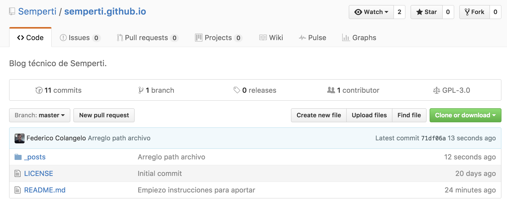
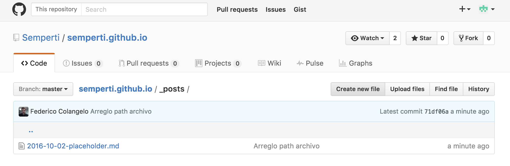
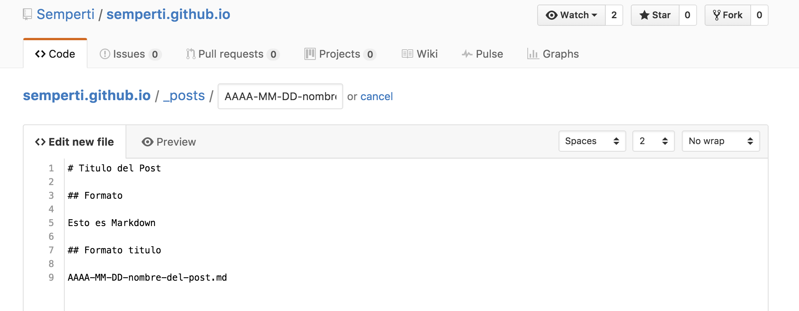
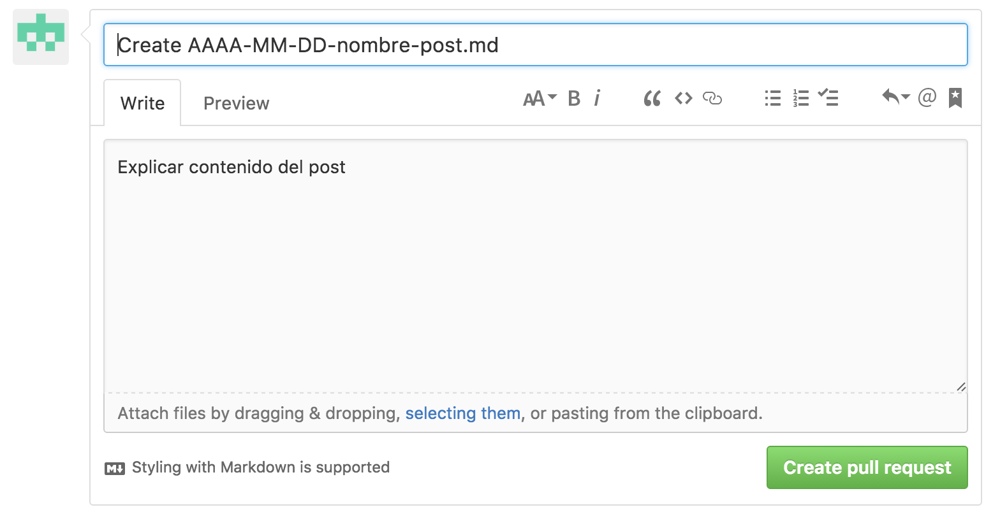
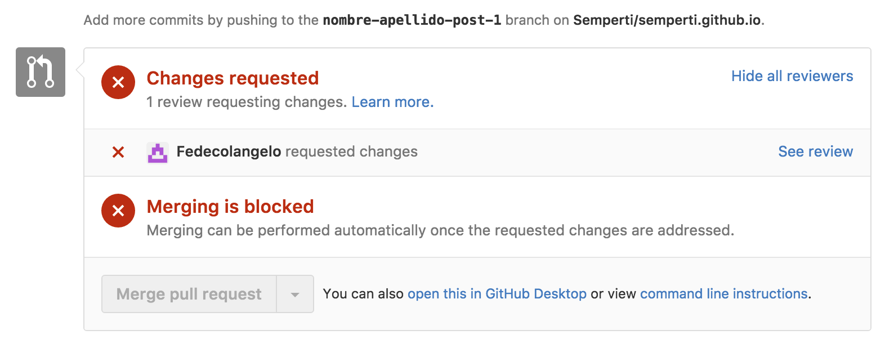
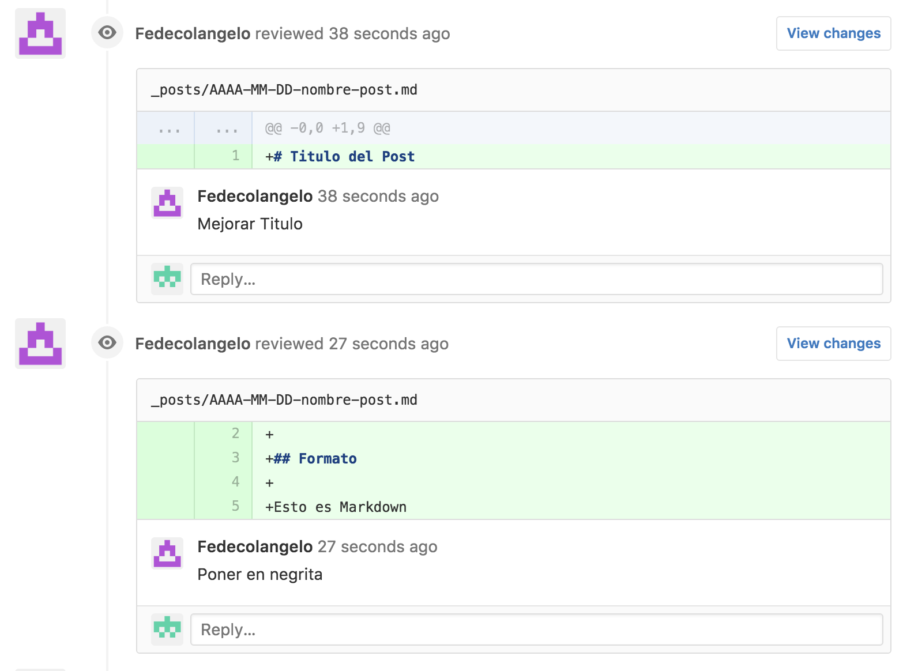
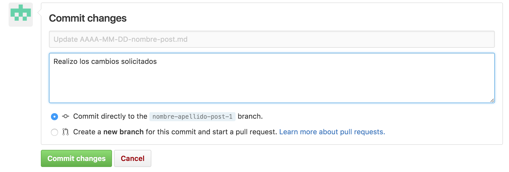

# Blog Técnico de Semperti

## Instrucciones para aportar con post técnicos

Para poder sumar post técnicos en la comunidad de Semperti lo primero que debe suceder es ser invitado a formar parte de la organización de GitHub de Semperti en calidad de escritor.

Para esto se deberá enviar el usuario de GitHub a blog@semperti.com.

Cuando esto suceda se recibirá una notificación via mail la cual deberá ser aceptada.

Una vez dentro de la organización se deberá seleccionar el repositorio Semperti/semperti.github.io e ir al directorio \_posts como indica la imagen:

Una vez dentro del directorio de \_posts se deberá crear el archivo que representará la entrada en el Blog mediante el boton de "Crear Nuevo Archivo".

El nombre del archivo deberá tener el formato AAAA-MM-DD-nombre-del-post.md y seguirá la convención de escritura de Jekyll en formato Markdown.

Una vez dentro del editor, simplemente completamos el nombre del archivo del post y su contenido.

Cuando finalizamos el post, vamos hacia la parte de abajo de la página del editor y realizamos el *commit* del mismo, agregando un título y comentario acorde.

Como se puede ver en la imagen a continuación, el post no se sube directamente al *maste* ya que el mismo representa el blog en producción, sino que se crea un entorno de *staging*, en este caso una *branch* aparte.

Esto a su vez genera un *pull request*, esto es un mecanismo por el cual se notifica al grupo de editores que alguien solicitó subir un post y entra en proceso de revisión.

A continuación puede verse la interfaz del *pull request*.

En este momento podría suceder que el editor estuviera de acuerdo con todo el post y lo uniera al *master*.

En caso contrario el editor solicitará cambios los cuales se notificarán via mail en la casilla configurada en la cuenta de GitHub.

Ahi habrá un link para ver la revisión realizada por el editor. 

Este link nos lleva a la siguiente interfaz:

Haciendo click en "Ver Review" se verán los cambios indicados por el editor.

Para realizar los cambios deberá seleccionarse el archivo del post, realizar los cambios y volver a realizar el *commit*, así:

Este proceso podrá repetirse hasta que esten todos los cambios aceptados y el post se incluya en el *master*.

### Alternativas

Si bien este instructivo apunta a utilizar la interfaz propuesta por GitHub, al ser un repositorio más, puede utilizarse el cliente git que sea de preferencia.

### Info Adicional

[Guia Markdown](https://guides.github.com/features/mastering-markdown/)

[Guia Jekyll](https://jekyllrb.com/docs/posts/)

[Guia Git](https://git-scm.com/book/en/v2/Getting-Started-Git-Basics)

